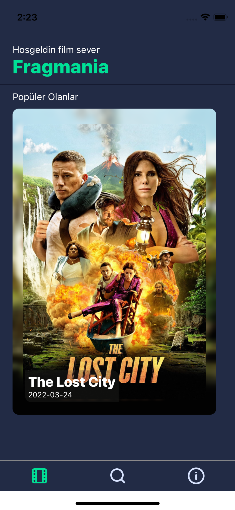
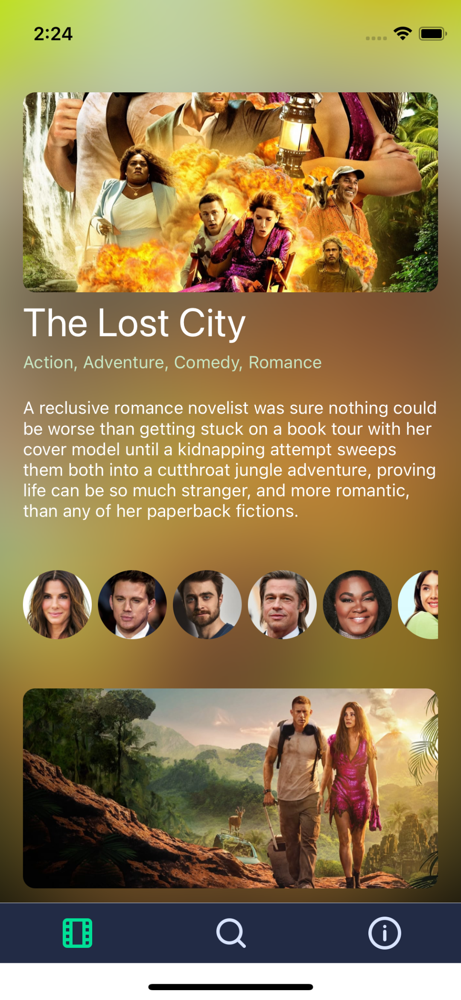
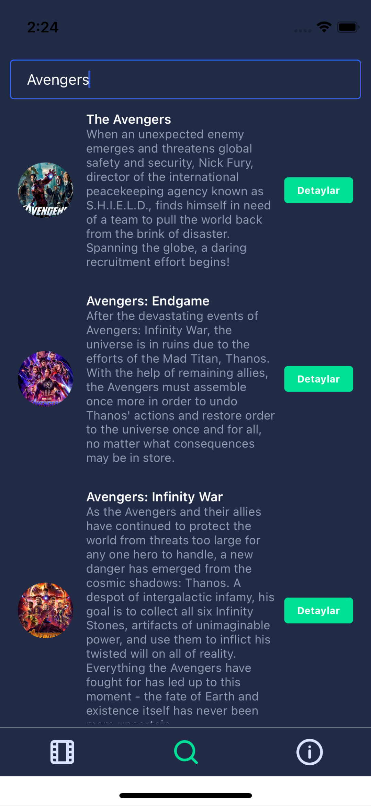
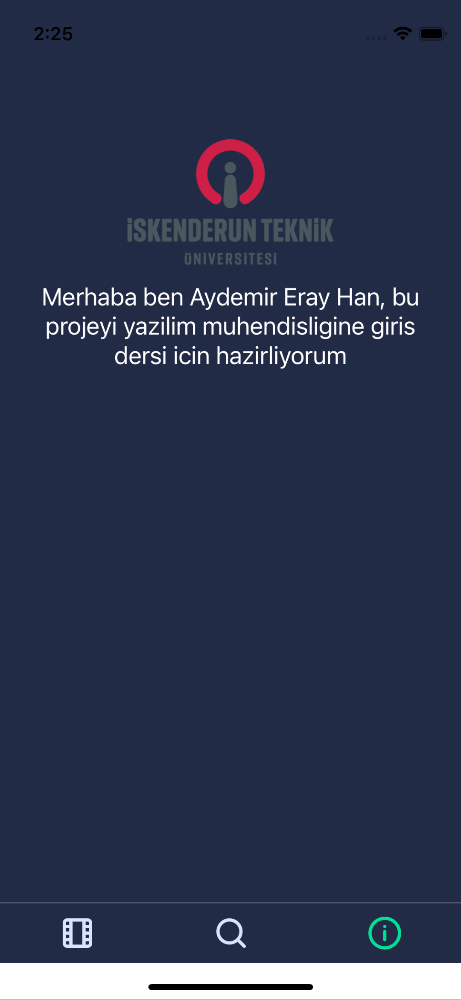

# Fragmania

## _Film bilgileri ve fragmanları_

## Projenin Amacı

Projenin amacı internet erişimimizin olduğu her yerde yeni sineme filimlerinden ve bu filimlerin detaylarından haberdar olmak.

## Teknik Detayları

Proje React Native kullanılarak cross platform desteğiyle hazırlanacaktır.Veriler themoviedb api sisteminden alınacaktır.

## Özellikler

- Themoviedb.org api sistemi
- Film Detayları
- Fragmanlar
- Oyuncular
- Gelişmiş Arama Sistemi

- [x] Proje Asamalari
  - [x] Expo ile projenin olusturulmasi
  - [x] Tasarim elemanlarinin hazirlanmasi
  - [x] Themooviedb api alinmasi
  - [x] Api verilerinin alinmasi ve ui'a islenmesi
  - [x] Proje bitisi

## Proje Resimleri

## Diagram

## Kişiler

Aydemir Eray Han
